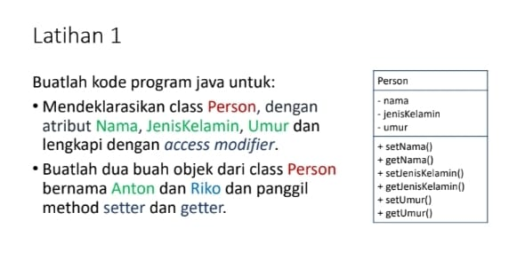
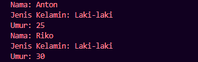

# Tugas Praktikum 3 (Pertemuan ke 4) 

|Nama|NIM|Kelas|Mata Kuliah|
|----|---|-----|------|
|**Wishnu Aqbil Ramadani**|**312310591**|**TI.23.A6**|**Pemrograman Orientasi Objek**|



# • Mendeklarasikan class Person, dengan atribut Nama, JenisKelamin, Umur dan lengakpi dengan acces modifier

# Input Code :

## • Deklarasi Kelas Person :
```java
public class Person {
```
### Penjelasan
```
- Ini adalah deklarasi kelas Person. Kelas ini akan digunakan sebagai cetak biru untuk membuat objek-objek Person.
- public berarti kelas ini dapat diakses dari mana saja
```

## • Atribut (Variabel) Kelas :
```java
 private String nama;
    private String jenisKelamin;
    private int umur;
```
### Penjelasan
```
Tiga atribut dideklarasikan sebagai private, yang berarti mereka hanya bisa diakses dari dalam kelas Person. Atribut ini adalah:
- nama: Menyimpan nama seseorang.
- jenisKelamin: Menyimpan jenis kelamin seseorang.
- umur: Menyimpan umur seseorang.
```

## • Method Setter :
### Penjelasan
```
Metode setter digunakan untuk mengatur nilai dari atribut yang bersifat private.
```
```java
 public void setJenisKelamin(String jenisKelamin) {
        this.jenisKelamin = jenisKelamin;
    }
```
```
- setNama() adalah setter untuk atribut nama. Metode ini menerima satu parameter (nama) dan mengatur nilai atribut nama dalam objek.
```
```
- Begitu juga untuk atribut jenisKelamin dan umur :
```
```java
 public void setJenisKelamin(String jenisKelamin) {
        this.jenisKelamin = jenisKelamin;
    }
```

## • Method Getter :
### Penjelasan
```
Metode getter digunakan untuk mengambil nilai dari atribut yang bersifat private.
```
```java
public String getNama() {
        return nama;
    }
```
```
- getNama() adalah getter untuk atribut nama. Metode ini tidak menerima parameter dan mengembalikan nilai nama dari objek.
```
```
Begitu juga untuk atribut jenisKelamin dan umur :
```
```java
public String getJenisKelamin() {
        return jenisKelamin;
    }
```

## • Main Method :
### Penjelasan
```
- Method ini adalah titik awal eksekusi program. Di dalam method ini, kita akan membuat dua objek (anton dan riko), mengatur nilai atribut mereka menggunakan setter, dan mengambil serta menampilkan nilai menggunakan getter.
```
```java
public static void main(String[] args) {
```

## • Membuat Objek Anton :
```java
Person anton = new Person();
        anton.setNama("Anton");
        anton.setJenisKelamin("Laki-laki");
        anton.setUmur(25);
```
### Penjelasan
```
- Objek anton dibuat dari kelas Person. Kemudian, kita menggunakan setter (setNama(), setJenisKelamin(), dan setUmur()) untuk mengatur nilai atribut nama, jenisKelamin, dan umur untuk objek anton.
```

## • Membuat Objek Riko :
```java
Person riko = new Person();
        riko.setNama("Riko");
        riko.setJenisKelamin("Laki-laki");
        riko.setUmur(30);
```
### Penjelasan
```
- Objek riko dibuat dengan cara yang sama seperti anton, tetapi denngan nilai yang berbeda untuk atribut nama, jenisKelamin, dan umur.
```

## • Menampilkan Nilai Atribut Anton dan Riko :
```java
System.out.println("Nama: " + anton.getNama());
        System.out.println("Jenis Kelamin: " + anton.getJenisKelamin());
        System.out.println("Umur: " + anton.getUmur());
  
        System.out.println("Nama: " + riko.getNama());
        System.out.println("Jenis Kelamin: " + riko.getJenisKelamin());
        System.out.println("Umur: " + riko.getUmur());
    }
  }
```
```
 - Kita menggunakan getter (getNama(), getJenisKelamin(), dan getUmur()) untuk mendapatkan nilai dari atribut pada objek anton dan riko, dan menampilkannya menggunakan System.out.println().
```

# Output :


